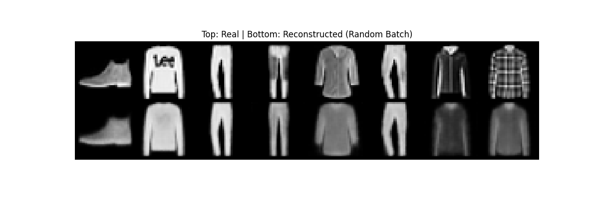
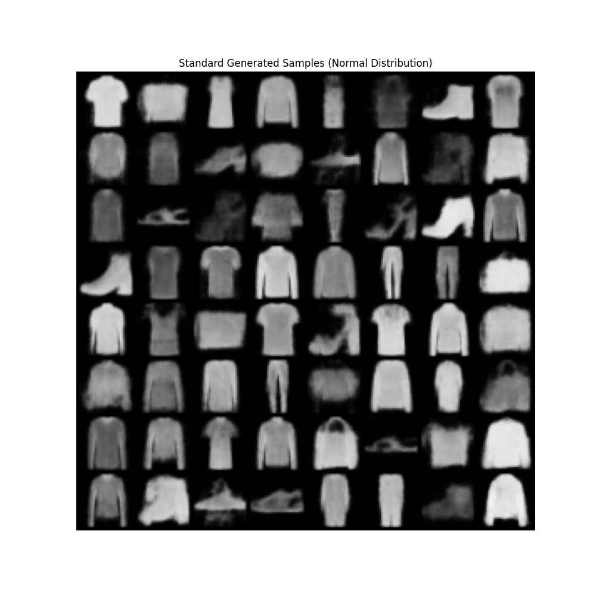
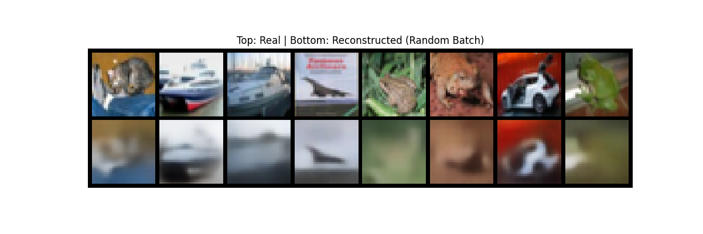
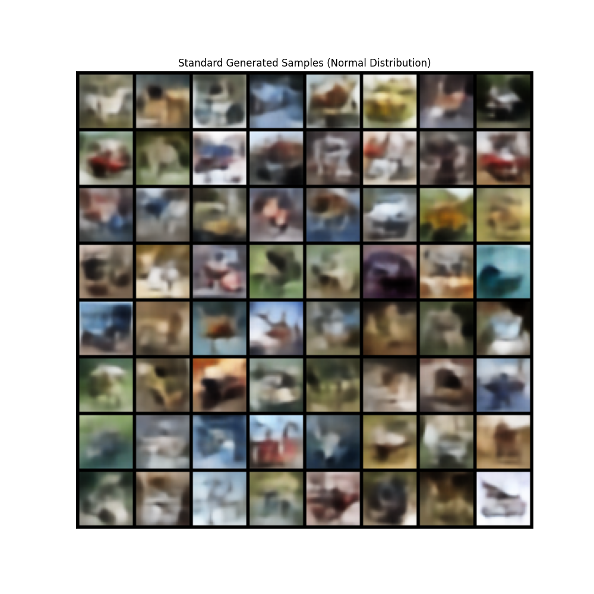
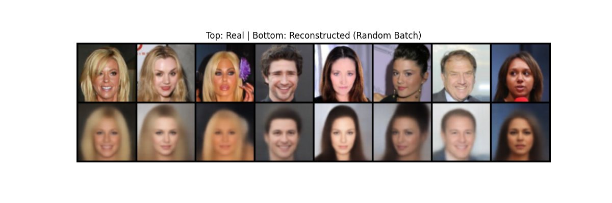
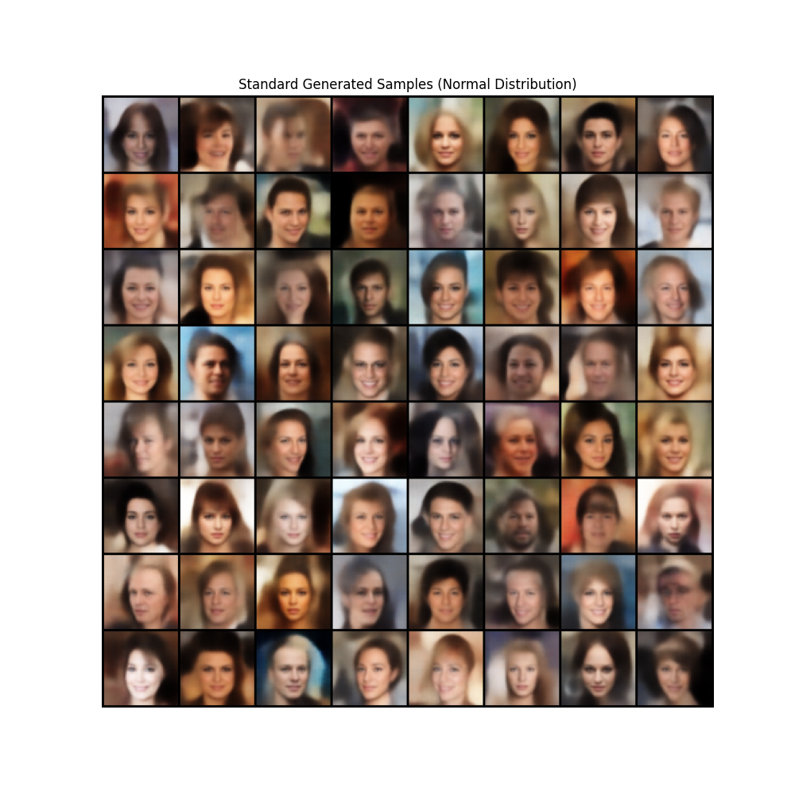

# VAE Baseline: Engineering Report & Ablation Study


[](https://drive.google.com/drive/folders/1vYwpqT77eHL0fIABns06-Tp9nX2qJ4MN?usp=sharing)

This repository contains a robust implementation of a Convolutional Variational Autoencoder (VAE) with dynamic architecture scaling. The project focuses on an extensive **Ablation Study** to stabilize training, prevent Posterior Collapse, and balance the trade-off between Reconstruction Quality and Latent Space regularity across three datasets of varying complexity.

> **Note:** To reproduce the analysis below, download the logs from the link above, run `tensorboard --logdir tb_logs`, and toggle the specific versions mentioned in each section.

## 1. Datasets & Preprocessing

The architecture was stress-tested on three datasets to ensure scalability and robustness:

| Dataset | Dimensions | Complexity | Preprocessing |
| :--- | :--- | :--- | :--- |
| **Fashion-MNIST** | 1x32x32 | Low (Simple Shapes) | `ToTensor`, Normalization |
| **CIFAR-10** | 3x32x32 | High (Textures, Backgrounds) | `ToTensor`, Normalization |
| **CelebA** | 3x64x64 | Medium (Aligned Faces) | `CenterCrop(140)`, `Resize(64)`, `ToTensor` |

## 2. Dynamic Architecture

To address the different information density of the datasets, the model architecture (Encoder/Decoder depth and width) is dynamically configured via Hydra.

### Configuration Summary
| Parameter | F-MNIST (Small) | CIFAR-10 (Wide) | CelebA (Deep) | Reason |
| :--- | :--- | :--- | :--- | :--- |
| **Latent Dim** | 32 | 256 | 256 | F-MNIST requires a bottleneck to learn features; CIFAR needs capacity. |
| **Hidden Dims** | `[32, 64]` | `[64, 128, 256, 512]` | `[64, 128, 256, 512]` | CIFAR requires wide channels for textures; CelebA requires depth for 64px. |
| **Activation** | LeakyReLU | LeakyReLU | LeakyReLU | Standard for GANs/VAEs. |
| **Safety** | Interpolation | Interpolation | Interpolation | `F.interpolate` ensures output size consistency. |

## 3. Loss Design

We utilize the **ELBO (Evidence Lower Bound)** loss function with a tunable $\beta$ parameter ($\beta$-VAE formulation):

$$\mathcal{L} = \mathcal{L}_{\text{Recon}} + \beta \cdot \mathcal{L}_{\text{KL}}$$

* **Reconstruction:** MSE Loss (`reduction='sum'`). We avoided pixel-wise normalization to maintain standard gradient magnitudes for the Adam optimizer (`lr=0.001`).
* **Regularization:** KL Divergence (Analytical).
* **$\beta$-Scheduling:** Implemented support for **Cyclic Annealing** and **Warmup** strategies to control the learning dynamics.

## 4. Engineering Experiments & Findings (Ablation Study)

### 4.1. Stability: Gradient Clipping
Early experiments showed significant loss fluctuations and occasional NaN values.
* **Finding:** Experimental results established that a stricter gradient limit (**0.1**) prevents noise dominance in the early stages compared to a softer limit (**0.5**).

> **[TensorBoard Verification]**
> Select and compare these two runs to see the difference in Loss stability:
> * 🔴 **Soft Clip (0.5):** `vae_annealing_clip_fashion_mnist/version_2` (Noisier gradients)
> * 🟢 **Strict Clip (0.1):** `vae_annealing_clip_fashion_mnist/version_1` (Stable convergence)

### 4.2. Latent Space: KL Annealing
We tested whether slowly introducing the KL penalty helps convergence versus a static $\beta$.
* **Finding (F-MNIST):** Experiments showed that for low-complexity datasets, Annealing does not significantly improve final metrics compared to a well-tuned static $\beta$, as the model avoids collapse naturally.

> **[TensorBoard Verification]**
> Compare the convergence curves of static vs dynamic scheduling:
> * 🔵 **Static $\beta=0.8$:** `vae_annealing_clip_fashion_mnist/version_6`
> * 🟠 **Annealing $\to 0.8$:** `vae_annealing_clip_fashion_mnist/version_5`
> * *Observation:* Both achieve similar final loss, confirming the model's robustness on simple data.

### 4.3. The Reconstruction-Generation Trade-off ($\beta$ Tuning)
We observed the classic VAE conflict: high $\beta$ yields good sampling but blurry images; low $\beta$ yields sharp images but broken sampling.

* **Fashion-MNIST Decision:** We selected **$\beta=0.8$** (Run: `version_6`) as the optimal trade-off.
* **CIFAR-10 Challenge:** To tackle the inherent "blurriness" on CIFAR-10, we implemented a **Warmup Strategy** (15 epochs with $\beta=0$) combined with a low final $\beta=0.1$.

> **[TensorBoard Verification]**
> * **Collapse:** `vae_annealing_clip_cifar10/version_1` ($\beta=1.0$ leads to blurriness).
> * **Optimized:** `vae_annealing_clip_final_cifar10` (Warmup + Low $\beta$ yields recognizable objects).

### 4.4. High-Resolution Scaling (CelebA)
Scaling to 64x64 faces introduced instability in the KL component ("spiking" loss).
* **Fix:** We implemented a short **Warmup (2 epochs)** followed by a high **$\beta=0.9$**.
* **Result:** The high $\beta$ value proved essential for maintaining a structured latent space, while the deep architecture (4 layers) successfully captured identity details.

## 5. Results

### Fashion-MNIST (Final Config)
> Sharp reconstruction and smooth interpolation between classes (e.g., Boot $\to$ Sneaker).




### CIFAR-10 (Wide Architecture)
> Despite the inherent limitations of MSE loss (blurriness), the "Wide" architecture (`[128, 256, 512]`) successfully captures object semantics (cars, animals) after applying the Warmup strategy.




### CelebA (Deep Architecture)
> The model successfully captures facial attributes. $\beta=0.9$ preserved identity while maintaining a valid normal distribution for sampling.




## 6. How to Run

### Installation
For detailed step-by-step installation instructions and environment setup, please refer to the **`manual_setup.txt`** file included in this repository.

### Training
To train the model, simply configure the desired parameters (dataset, architecture, hyperparameters) in **`configs/config.yaml`** and run:

```bash
python src/train.py
```

### Monitoring
To view loss curves and generated image grids during training:

```bash
tensorboard --logdir tb_logs
```

## 7. Future Work

While this baseline successfully demonstrates the mechanics of VAEs and the importance of hyperparameter tuning, there are several directions to improve image sharpness and generation diversity, especially for complex datasets like CIFAR-10.

1.  **Perceptual Loss (LPIPS):** The current MSE loss operates on pixel-wise differences, which leads to "blurry" averages when the model is uncertain. Replacing or augmenting MSE with a VGG-based Perceptual Loss (LPIPS) would force the model to optimize for semantic similarity and texture, significantly reducing blurriness.

2.  **Vector Quantized VAE (VQ-VAE):** Moving from a continuous Gaussian latent space to a discrete codebook avoids the "posterior collapse" issue entirely and typically produces much sharper images by learning a fixed vocabulary of visual parts.

3.  **Latent Diffusion Models:** This VAE can serve as the first stage (perceptual compression) for a Latent Diffusion Model. Training a diffusion model in the compressed latent space of our VAE would allow for high-resolution, high-fidelity generation, overcoming the limitations of pure VAE sampling.